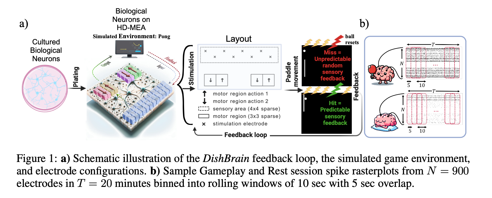
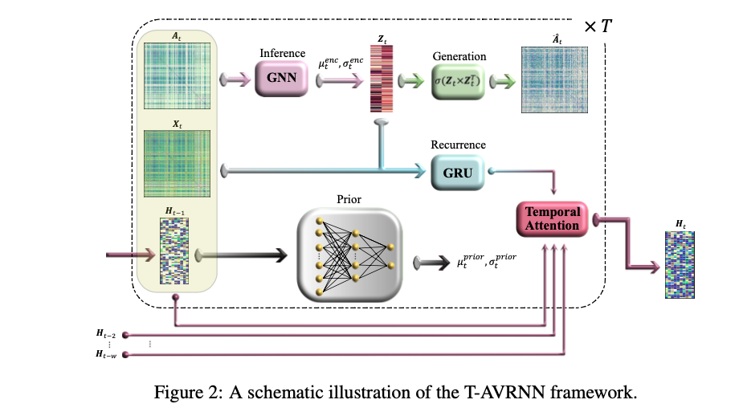

# Temporal Attention-enhanced Variational Graph Recurrent Neural Network (T-AVRNN)

This repository contains the code and data associated with the paper:

**"Dynamic Analysis of Live Neurons and Behavior via Temporal Attention-enhanced Variational Graph RNN"**.

## Abstract

We introduce a novel framework for analyzing the complex network dynamics oflive biological neuronal systems engaged in real-time, closed-loop interactions within a simulated environment of the arcade game Pong. By employing a system called DishBrain , which integrates in vitro neuronal networks with in silico computation through a high-density multi-electrode array, we aim to elucidate the changes in network structure and node connections in response to external stimuli during varying performance levels. We propose a Temporal Attention-enhanced Variational Graph Recurrent Neural Network (T-AVRNN ), designed to capture and relate temporal snapshots of the game based on similarity in network features. This framework facilitates the first-time utilization of dynamic graph representation of real electrophysiological (neuronal) data to investigate neuronal connectivity patterns within the DishBrain system, focusing on the evolving neuronal connectivity during game interaction. Our findings indicate that sensory channels, responsible for receiving stimulation and feedback, must align closely with certain motor channel subregions to achieve higher game performance. This alignment diverges in different motor regions corresponding to distinct paddle movements, revealing a clear relationship between performance quality and connectivity patterns. The T-AVRNN ’s capacity to differentiate between neuronal states associated with successful and unsuccessful learning outcomes, along with identifying key learning patterns, offers significant insights for real-time monitoring and potential manipulation of biological neuronal systems. This study advances our understanding of biological information processing systems’ adaptability and learning mechanisms, while also inspiring new or enhanced algorithmic approaches in machine learning.

<div style="text-align: center;">
    
</div>

<div style="text-align: center;">
    
</div>

## Data Description

The dataset includes neuronal data from 24 different cultures integrated on HD-MEAs during 437 experimental sessions (262 ‘Gameplay’; 175 ‘Rest’). The data was recorded at 20 kHz sampling frequency, with spiking events from sensory and motor channels extracted for analysis. Each session contains 20 minutes of gameplay or 10 minutes of rest.

## Key Features

- **Temporal Attention Mechanism**: Enhances the model's sensitivity to changes over time by evaluating the similarity of the network’s structure across different time steps.
- **Variational Graph Recurrent Neural Network (VGRNN)**: Captures the complex interplay between network topology and node attributes.
- **Dynamic Graph Representation**: Utilizes zero-lag Pearson correlations to construct network adjacency matrices, representing functional connectivity between neuronal channels.

## Repository Structure

- `T-AVRNN_DishBrain.ipynb`: Jupyter notebook containing the implementation of the T-AVRNN model and analysis.

## Requirements

To run the code in this repository, you will need the following packages:


```bash
- python 3.x
- scikit-learn
- scipy
- NumPy
- Pytorch
pip install torch-scatter
pip install torch-sparse
pip install torch-cluster
pip install torch-spline-conv
pip install torch-geometric==1.0.2
pip install torchvision


